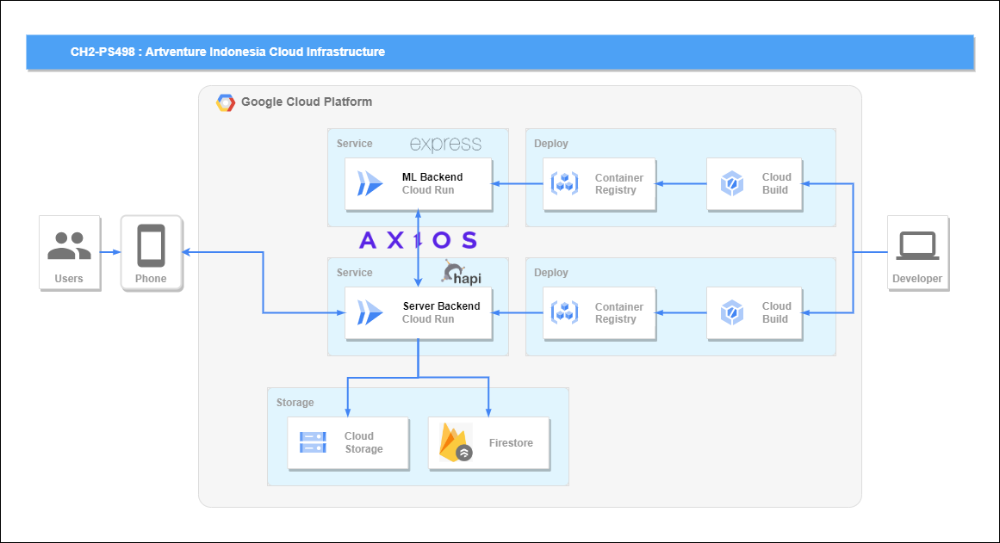

# ArtventureIndonesia-CC

// explain something about cloud computing

## Authors by Team ID: `CH2-PS498`
| Name                                    | Bangkit-ID    | Cohort              |
|-----------------------------------------|---------------|---------------------|
| Syaiful Hendri Irawan                   | `M193BSY1058` | Machine Learning    |
| Anak Agung Sagung Mirah Indira Wardhana | `M014BSX1481` | Machine Learning    |
| Arya Dimas Taffarel Wicaksana           | `M200BSY0953` | Machine Learning    |
| __Muhammad Tafif Qairawan Assiddiqi__   | `C324BSY3736` | __Cloud Computing__ |
| __Ida Bagus Mas Manuaba__               | `C014BSY4272` | __Cloud Computing__ |
| I Gede Krisna Juniarta                  | `A014BSY2738` | Mobile Development  |

# Cloud Infrastructure

# API Reference

## Endpoint Routes

| Route                                                    | HTTP Method | Description                                   |   API   |
|----------------------------------------------------------|-------------|-----------------------------------------------|---------|
| [**/users/login**](#users-login)                         | POST        | User login                                    | Backend |
| [**/users/register**](#users-register)                   | POST        | User registration                             | Backend |
| [**/museum**](#museum)                                   | GET         | Get all museums                               | Backend |
| [**/museum/museum_id**](#museummuseum_id)                | GET         | Get all tasks for a museum                    | Backend |
| [**/museum/museum_id/task_id**](#museummuseum_idtask_id) | GET         | Get task by ID                                | Backend |
| [**/rewards**](#rewards)                                 | GET         | Get all rewards                               | Backend |
| [**/rewards/reward_id**](#rewardsreward_id)              | GET         | Get reward by ID                              | Backend |
| [**/predict**](#predict)                                 | POST        | Perform image prediction and validation       | Backend |
| [**/predicts**](#predicts)                               | POST        | Upload and process image in Machine Learning  |    ML   |

### Backend API

- Deployed Endpoint : `https://artventure-server-backend-bx6pwrssuq-et.a.run.app`

- Full Documentation : `https://documenter.getpostman.com/view/20128885/2s9YkhiQGB`

- Tools and Packages :
  - **@google-cloud/storage:** Version 7.7.0
  - **@hapi/hapi:** Version 21.3.2
  - **axios:** Version 1.6.2
  - **firebase-admin:** Version 11.11.1
  - **form-data:** Version 4.0.0
  - **fs:** Version 0.0.1-security

  
  
  
  
  
  

`⚠️ Before making requests to this API, please note that an API key is required for authentication ⚠️`

#### Users
1.  `/users/login`
   - API: Backend
   - Description: User login
   

2.  `/users/register`
   - API: Backend
   - Description: User registration
   

#### Museum and Task

1.  `/museum`
    - API: Backend
    - Description: Get all museums
   

2.  `/museum/museum_id`
    - API: Backend
    - Description: Get all tasks for a museum
   

3.  `/museum/museum_id/task_id`
    - API: Backend
    - Description: Get task by ID
   

#### Rewards

1.  `/rewards`
    - API: Backend
    - Description: Get all rewards
   

2.  `/rewards/reward_id`
    - API: Backend
    - Description: Get reward by ID
   

#### Predict

1.  `/predict`
    - API: Backend
    - Description: Perform image prediction and validation
   

### ML API

- Deployed Endpoint : `https://ml-tfjs-bx6pwrssuq-et.a.run.app`

- Full Documentation : `https://documenter.getpostman.com/view/20128885/2s9Ykq6fVa`

- Tools and Packages :
  - **@tensorflow/tfjs-node:** Version 4.14.0
  - **express:** Version 4.18.0
  - **fs:** Version 0.0.1-security
  - **multer:** Version 1.4.5-lts.1

  
  
  
  

#### Predict

1.  `/predicts`
    - API: ML
    - Description: Upload and process image in Machine Learning
   
